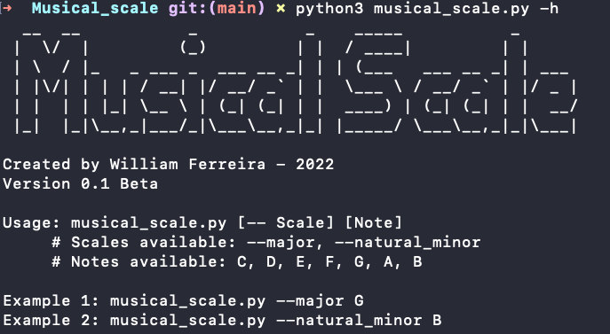
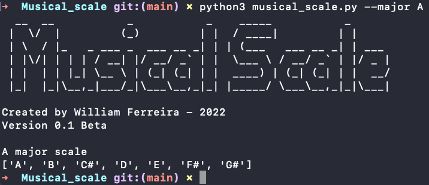
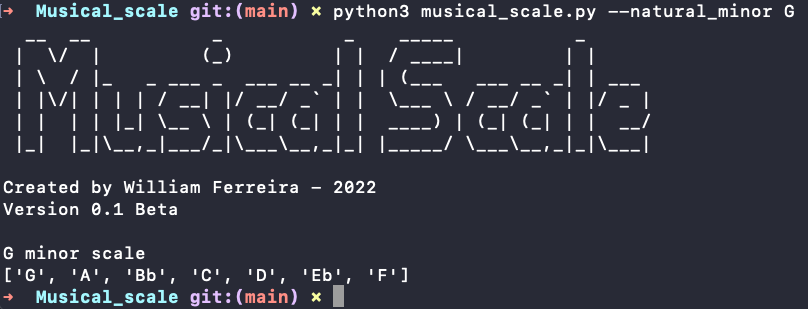

# 🎵 Musical Scale


* [About](#about) 
* [How To Use](#how-to-use)
  * [Help](#help)
  * [Major](#major)
  * [Natural minor](#natural-minor)
* [Next Versions](#next-versions)
  
#

## About

This program is designed to help students of music and music theory learn musical scales.


## How To Use

In order to run the program you must download the repository as shown below.

```bash

git clone https://github.com/willian20091/Musical_scale.git 

cd Musical_scale

python musical_scale.py

```
The following features are currently available

### Help

```bash
python musical_scale.py [--help] or [-h]
```

	


### Major

Generates the major scale for the required note `C, D, E, F, G, A or B`

```bash
python musical_scale.py [--major] [Note]
```

	

### Natural Minor


Generate the natural minor scale for the required note `C, D, E, F, G, A or B`

```bash
python musical_scale.py [--natural_minor] [Note]
```
	


## Next Versions

- [x] Help
- [x] Major
- [x] Natural Monir
- [ ] Harmonic Minor
- [ ] Melodic Minor

#

Made with 💜 at Willan Ferreira 